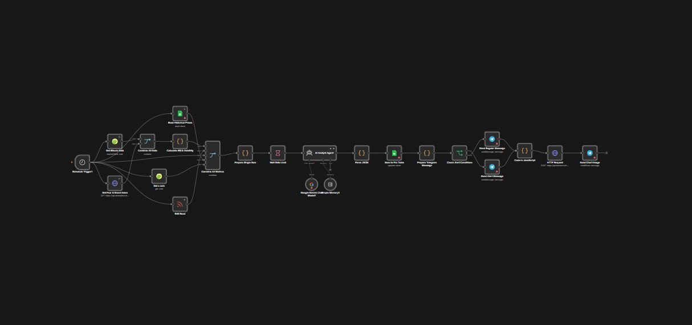

# 📊 CryptoMind AI Pro: Аналитическая станция институционального уровня

   

---

### 🛠 Архитектура системы

> **Почему CryptoMind?**
> Большинство трейдеров терпят неудачу из-за эмоций. CryptoMind исключает человеческий фактор, используя нейросети для оценки настроений рынка 24/7. Это не просто бот, это ваш личный аналитический отдел уровня хедж-фонда.

---

### 🧠 Основной интеллект

* **Мониторинг рынка:** Сбор данных в реальном времени через **CoinGecko API** для высочайшей точности.
* **Глубокий анализ настроений:** Многомодельный анализ с использованием **Gemini Pro и GPT-4o** для интерпретации рыночных трендов и новостей.
* **Институциональная логика:** Усовершенствованные алгоритмы фильтрации и оценки для отделения рыночного сигнала от шума.
* **Мгновенные оповещения:** Профессиональная **доставка в Telegram** с практическими рекомендациями и оценками уровня уверенности.

---

### ⚙️ Технологический стек
* **Движок:** n8n (расширенная автоматизация рабочих процессов)
* **ИИ-модели:** Google Gemini Pro, OpenAI GPT-4o
* **Источники данных:** CoinGecko API, финансовые RSS-ленты
* **База данных:** Опциональная интеграция с Supabase/PostgreSQL для отслеживания истории

---

### 🚀 Внедрение
Это профессиональный JSON-шаблон для n8n. Развертывание упрощено как для экспертов, так и для новичков.
* **Время настройки:** < 5 минут.
* **Требования:** Экземпляр n8n, API-ключи для LLM.

---

### 🛒 Начать работу
Раскройте всю мощь автоматизированной криптоаналитики уже сегодня.

[**👉 Получить полный доступ на Gumroad**](https://naroka.gumroad.com/l/CryptoMindAIProAnalyst)

---

## 🚀 Готовы делегировать рутину искусственному интеллекту?

Я разрабатываю **кастомные автоматизации и ИИ-ассистенты на базе n8n**, которые работают 24/7 и экономят десятки часов вашего времени. Я беру на себя весь процесс: от анализа ваших задач до внедрения готового решения «под ключ».

### Связаться со мной:

* 💬 **Telegram:** [t.me/nar00ka](https://t.me/nar00ka) — давайте обсудим вашу идею за 10 минут.
* 🐙 **GitHub:** https://github.com/nar0ka — изучите мои open-source проекты.
* 📦 **Gumroad:** https://naroka.gumroad.com — посмотрите готовые к использованию воркфлоу.
* 

> **💡 Бонус:** Если вы не уверены, с чего начать автоматизацию, просто напишите мне — я помогу определить, какие процессы можно оптимизировать уже сегодня!

---

*Разработано [Naroka Studio](https://github.com/Naroka-Studio)*
